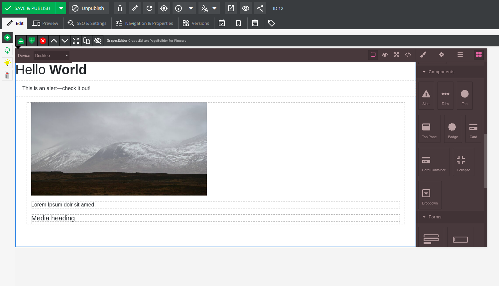
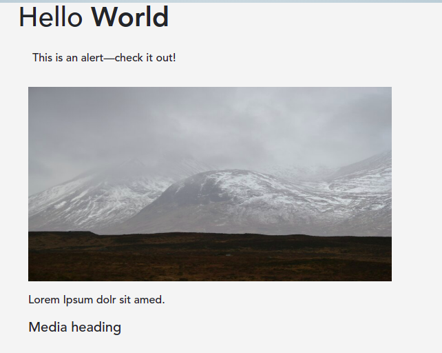

# Pagebuilder for Pimcore

This is currently a Work in Progress but already functional implementation of a page builder for Pimcore.

Installation: `composer require cbenco/pimcore-pagebuilder-bundle`

The pagebuilder contains a bootstrap-plugin.
In the future, the components should be either standalone or based entirely on tailwindcss.  
It contains an example area-brick, which currently looks like this:

and renders it to the frontend:

------------

Next Todos:

- [ ] (WIP) replacing GrapeJs-Richtext-Editor with PimCore's CKEDITOR
- [ ] Supporting drag'n'drop of assets
- [ ] Supporting upload of videos (currently only images are supported)
- [ ] Adding support for registered Area-Bricks
- [ ] Functional/Selenium-Tests
- [ ] Replace bootstrap components with custom components
